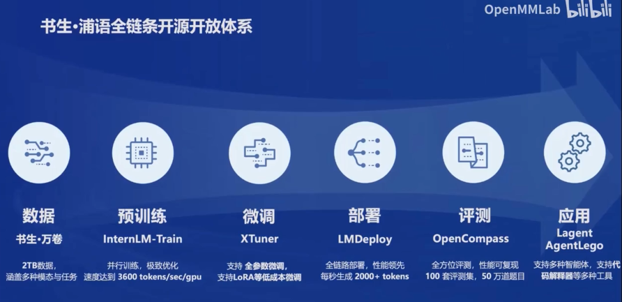

# 书生浦语全链条开源开放体系
  
开源链路体系👆

大模型全链路体系可视作：
- 准备数据集：数据（书生·万卷）
- 产出模型baseline：预训练 （InternLM-Train）
- 针对特定任务提升性能：微调 （XTuner）
- 模型部署：部署（LMDeploy）
- 能力扩展：应用（Lagent AgentLego）
- 性能评估：评测 （OpenCompass）

### 从数据出发
本人认为这里贴上[opendatalab](https://github.com/opendatalab)更合适  
这个仓库内包含有书生万卷大规模数据集、各种数据标注平台、PDF内容提取等等一系列自定义大模型数据集可能会用到的工具

### 从预训练出发
[InternEvo](https://github.com/InternLM/InternEvo/blob/develop/README-zh-Hans.md)或许应该是这个仓库！  
旨在使用**多卡加速**平台训练**一系列**大模型，支持Flash-Attention、Apex等**高性能计算库**！
### 从微调出发
[xtuner](https://github.com/InternLM/xtuner)  
也是本次训练营所使用的模型微调库！使用config一站式配置，在命令行完成所有操作，与本家各种工具链配合良好！  
### 从部署出发
[LMDeploy](https://github.com/InternLM/lmdeploy)  
也是本次训练营所使用的模型部署库！推理高校、量化可靠
### 从应用出发
[AgentLego](https://github.com/InternLM/agentlego) [Lagent](https://lagent.readthedocs.io/zh-cn/latest/)   
API丰富，易于集成，支持远程访问！
### 从评测出发
[OpenCompass](https://github.com/open-compass)
排行榜丰富，测试集很多！