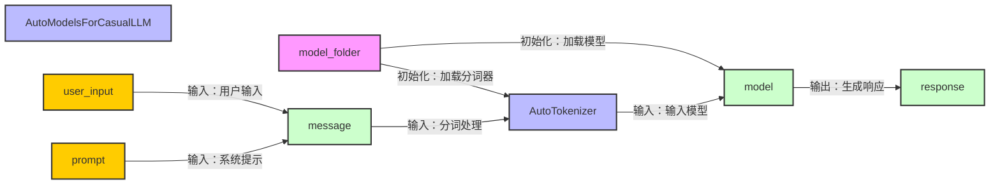

# InternLM2-1.8b部署流程
### 部署详解  
本次使用HuggingFace的AutoModels接口加载书生浦语大模型，并在命令行进行交互
具体运行流程如图所示

### 代码详解：
***
初始化，并指定prompt
```python
model_name_or_path = "/root/share/new_models/Shanghai_AI_Laboratory/internlm2-chat-1_8b"

tokenizer = AutoTokenizer.from_pretrained(model_name_or_path, trust_remote_code=True, device_map='cuda:0')
model = AutoModelForCausalLM.from_pretrained(model_name_or_path, trust_remote_code=True, torch_dtype=torch.bfloat16, device_map='cuda:0')
model = model.eval()
system_prompt = """You are an AI assistant whose name is InternLM (书生·浦语).
- InternLM (书生·浦语) is a conversational language model that is developed by Shanghai AI Laboratory (上海人工智能实验室). It is designed to be helpful, honest, and harmless.
- InternLM (书生·浦语) can understand and communicate fluently in the language chosen by the user such as English and 中文.
"""

messages = [(system_prompt, '')]
```
***
运行部分
```python
while True:
    input_text = input("\nUser  >>> ")
    input_text = input_text.replace(' ', '')
    if input_text == "exit":
        break

    length = 0
    for response, _ in model.stream_chat(tokenizer, input_text, messages):
        if response is not None:
            print(response[length:], flush=True, end="")
            length = len(response)
```
对话程序为一个显式的死循环。程序通过input方法读取用户的输入，input方法的参数为输入提示词，程序运行时显示在命令行中，input方法的返回值保存在变量input_text中，如果input_text的内容是"exit"，则退出该死循环。  
程序将分词器、用户输入、和消息记录（默认为prompt）输入到模型调用方法stream_chat中获取**流式响应**。流式响应使得模型的输出更加平滑，而不是 等一段时间 然后输出一大堆；为了适应流式响应输出，打印response采取了相应的策略。printf中的flush参数确保获取response后立即输出，end设置为空，避免换行。  


### 操作流程
- 创建镜像为CUDA-12.2的开发机  
- 配置环境  
```bash
# 创建环境
conda create -n demo python=3.10 -y
# 激活环境
conda activate demo
# 安装 torch
conda install pytorch==2.1.2 torchvision==0.16.2 torchaudio==2.1.2 pytorch-cuda=12.1 -c pytorch -c nvidia -y
# 安装其他依赖
pip install transformers==4.34 einops==0.8.0 sentencepiece==0.1.99
```
👆都是手册  
👇补两个库  
```bash
pip install accelerate
pip install protobuf
```
后创建[cli_demo.py文件](./cli_demo.py)  
执行   
```bash
python cli_demo.py
```

### 一些小问题
在根据 [文档](https://github.com/InternLM/Tutorial/tree/camp3/docs/L1/Demo) 进行操作时，有几个库没装，完全按照上述文档流程进行，运行cli_demo.py时，会遇到如下问题：
```bash
ImportError: 
InternLM2Converter requires the protobuf library but it was not found in your environment. Checkout the instructions on the
installation page of its repo: https://github.com/protocolbuffers/protobuf/tree/master/python#installation and follow the ones
that match your environment. Please note that you may need to restart your runtime after installation.
```
看起来还需要安装protobuf
执行 pip install protobuf
```bash
ImportError: Using `low_cpu_mem_usage=True` or a `device_map` requires Accelerate: `pip install accelerate`
```
看来还需要安装accelerate
执行 pip install accelerate 后
```bash
ERROR: pip's dependency resolver does not currently take into account all the packages that are installed. This behaviour is the source of the following dependency conflicts.
tokenizers 0.14.1 requires huggingface_hub<0.18,>=0.16.4, but you have huggingface-hub 0.24.2 which is incompatible.
Successfully installed accelerate-0.33.0 huggingface-hub-0.24.2 psutil-6.0.0
```
安装成功后出现这个提示，不过这个错误并不影响模型的运行
### 最终效果
推理资源占用如下图所示  
  
最终实现效果如下图所示  
