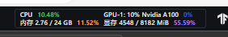
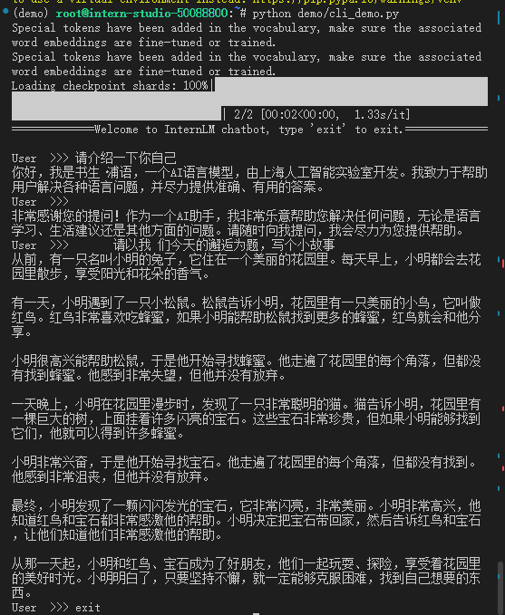

### 操作流程
- 创建镜像为CUDA-12.2的开发机  
- 配置环境  
```bash
# 创建环境
conda create -n demo python=3.10 -y
# 激活环境
conda activate demo
# 安装 torch
conda install pytorch==2.1.2 torchvision==0.16.2 torchaudio==2.1.2 pytorch-cuda=12.1 -c pytorch -c nvidia -y
# 安装其他依赖
pip install transformers==4.34 einops==0.8.0 sentencepiece==0.1.99
```
👆都是手册  
👇补两个库  
```bash
pip install accelerate
pip install protobuf
```
后创建[cli_demo.py文件](./cli_demo.py)  
执行   
```bash
python cli_demo.py
```

### 一些小问题
在根据 [文档](https://github.com/InternLM/Tutorial/tree/camp3/docs/L1/Demo) 进行操作时，有几个库没装，完全按照上述文档流程进行，运行cli_demo.py时，会遇到如下问题：
```bash
ImportError: 
InternLM2Converter requires the protobuf library but it was not found in your environment. Checkout the instructions on the
installation page of its repo: https://github.com/protocolbuffers/protobuf/tree/master/python#installation and follow the ones
that match your environment. Please note that you may need to restart your runtime after installation.
```
看起来还需要安装protobuf
执行 pip install protobuf
```bash
ImportError: Using `low_cpu_mem_usage=True` or a `device_map` requires Accelerate: `pip install accelerate`
```
看来还需要安装accelerate
执行 pip install accelerate 后
```bash
ERROR: pip's dependency resolver does not currently take into account all the packages that are installed. This behaviour is the source of the following dependency conflicts.
tokenizers 0.14.1 requires huggingface_hub<0.18,>=0.16.4, but you have huggingface-hub 0.24.2 which is incompatible.
Successfully installed accelerate-0.33.0 huggingface-hub-0.24.2 psutil-6.0.0
```
安装成功后出现这个提示，不过这个错误并不影响模型的运行
### 最终效果
推理资源占用如下图所示  
  
最终实现效果如下图所示  
