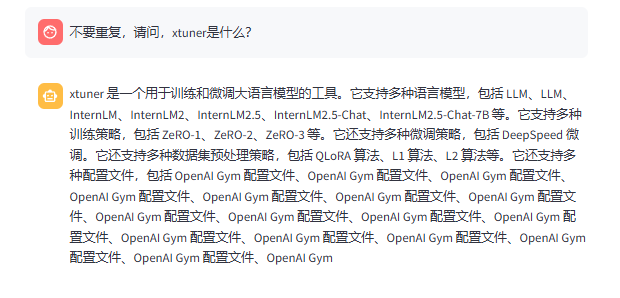
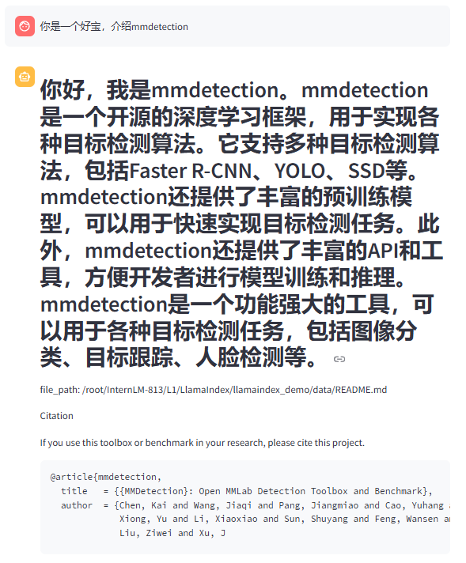
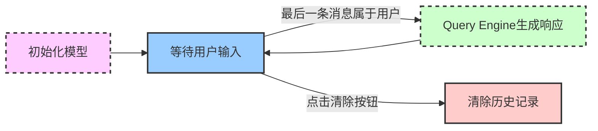
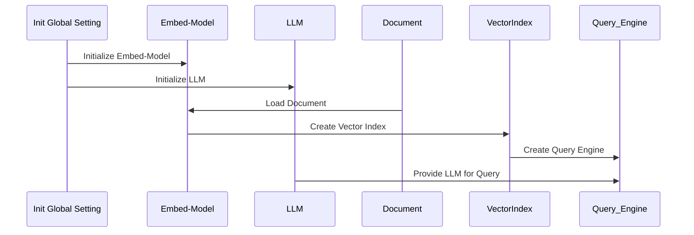

# llamaindex+Internlm2 RAG实践
根据[教程流程](https://github.com/InternLM/Tutorial/tree/camp3/docs/L1/LlamaIndex)进行实现  

### 复现流程
使用原生模型进行QA：
```bash
(llamaindex) root@intern-studio-50088800:~/InternLM-813/L1/LlamaIndex# python llamaindex_demo/llamaindex_internlm.py 
/root/.conda/envs/llamaindex/lib/python3.10/site-packages/pydantic/_internal/_fields.py:161: UserWarning: Field "model_id" has conflict with protected namespace "model_".

You may be able to resolve this warning by setting `model_config['protected_namespaces'] = ()`.
  warnings.warn(
Loading checkpoint shards: 100%|█████| 2/2 [00:13<00:00,  6.99s/it]
assistant: xtuner是一款用于播放音乐的软件，它支持多种音频格式，包括MP3、WAV、WMA、FLAC、AAC、APE、OGG、WMA、WAV、WMA、WMA、WMA、WMA、WMA、WMA、WMA、WMA、WMA、WMA、WMA、WMA、WMA、WMA、WMA、WMA、WMA、WMA、WMA、WMA、WMA、WMA、WMA、WMA、WMA、WMA、WMA、WMA、WMA、WMA、WMA、WMA、WMA、WMA、WMA、WMA、WMA、WMA、WMA、WMA、WMA、WMA、WMA、WMA、WMA、WMA、WMA、WMA、WMA、WMA、WMA、WMA、WMA、WMA、WMA、WMA、WMA、WMA、WMA、WMA、WMA、WMA、WMA、WMA、WMA、WMA、WMA、WMA、WMA、WMA、WMA、W
```
添加RAG之后的效果如下所示：  
```bash
(llamaindex) root@intern-studio-50088800:~/InternLM-813/L1/LlamaIndex/llamaindex_demo# python llamaindex_RAG.py 
/root/.conda/envs/llamaindex/lib/python3.10/site-packages/pydantic/_internal/_fields.py:161: UserWarning: Field "model_id" has conflict with protected namespace "model_".

You may be able to resolve this warning by setting `model_config['protected_namespaces'] = ()`.
  warnings.warn(
Loading checkpoint shards: 100%|██████████████████████████| 2/2 [00:14<00:00,  7.20s/it]
XTuner 是一个高效、灵活、全能的轻量化大模型微调工具库。
file_path: /root/InternLM-813/L1/LlamaIndex/llamaindex_demo/data/README_zh-CN.md

XTuner 是一个高效、灵活、全能的轻量化大模型微调工具库。
file_path: /root/InternLM-813/L1/LlamaIndex/llamaindex_demo/data/README_zh-CN.md

XTuner 是一个高效、灵活、全能的轻量化大模型微调工具库。
file_path: /root/InternLM-813/L1/LlamaIndex/llamaindex_demo/data/README_zh-CN.md

XTuner 是一个高效、灵活、全能的轻量化大模型微调工具库。
file_path: /root/InternLM-813/L1/LlamaIndex/llamaindex_demo/data/README_zh-CN.md

XTuner 是一个高效、灵活、全能的轻量化大模型微调工具库。
file_path: /root/InternLM-813/L1/LlamaIndex/llamaindex_demo
```

网页部署示例  
  
提示词或许对改善效果有帮助  
  
或许是训练或者finetune时出了一些问题，导致变成复读机？ 

### 作业流程  
仿照上述复现流程，打算让其介绍mmdetection！
未添加mmdetection仓库的介绍前，结果如图：  
  
看起来一塌糊涂！
***
添加[介绍](./llamaindex_demo/data/README.md)后，重新运行
```bash
streamlit run app.py
```  
成果记录！:



### 前置知识  
关于LlamaIndex  
> [LlamaIndex官方网站](https://docs.llamaindex.ai/en/stable/#introduction)


关于streamlit  
> [streamlit](https://streamlit.io/)  

### App架构

运行流程



Query Engine的生成架构：



