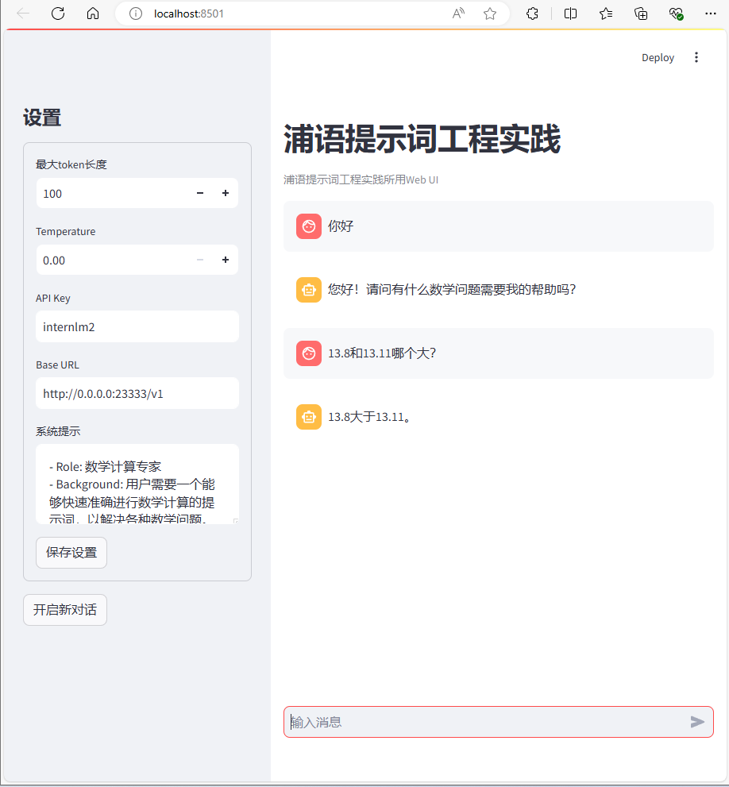

# PROMPT  
实验根据[该教程](https://github.com/InternLM/Tutorial/tree/camp3/docs/L1/Prompt)进行  
## 环境准备  
本实验基于[Demo实验](https://github.com/InternLM/Tutorial/tree/camp3/docs/L1/Demo)的实验环境进行，因为Demo环境中使用LMDeploy部署了模型，Demo环境问题述于该[笔记](../Demo/README.md)  
在Demo环境的基础上，需要安装
```bash
pip install openai
pip install streamlit
```
## 提示词配置
提示词由[Kimi x LangGPT](https://kimi.moonshot.cn/chat/cqkcpntvbf6v622bmdvg)生成;  
关于[LangGPT](https://langgptai.feishu.cn/wiki/RXdbwRyASiShtDky381ciwFEnpe?from=space_home_recent&pre_pathname=%2Fdrive%2Fhome%2F&previous_navigation_time=1722387212566)  
本实验[Prompt](./PROMPT.md)
## 最终效果
  
正确回答！

## 问题记录
运行环境 demo，执行命令后提示
```bash
(demo) root@intern-studio-50088800:~/Tutorial/tools# python -m streamlit run chat_ui.py
/root/.conda/envs/demo/bin/python: No module named streamlit
```
所以：
```bash
(demo) root@intern-studio-50088800:~/Tutorial/tools# pip install streamlit
```
之后执行，又遇到报错
```bash
(demo) root@intern-studio-50088800:~/Tutorial/tools# python -m streamlit run chat_ui.py

Collecting usage statistics. To deactivate, set browser.gatherUsageStats to false.


  You can now view your Streamlit app in your browser.

  Local URL: http://localhost:8501
  Network URL: http://192.168.237.234:8501
  External URL: http://192.168.237.234:8501

2024-07-30 19:04:42.451 Uncaught app exception
Traceback (most recent call last):
…………
ModuleNotFoundError: No module named 'openai'
```
因此执行
```
(demo) root@intern-studio-50088800:~/Tutorial/tools# pip install openai
```
