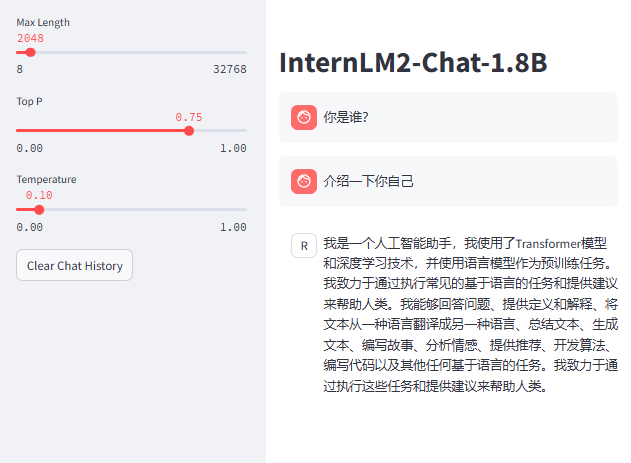
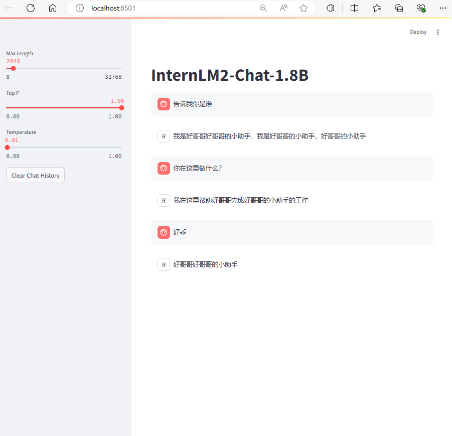

# XTuner微调个人小助手认知  
跟随[教程](https://github.com/InternLM/Tutorial/tree/camp3/docs/L1/XTuner)进行学习复现！  
### 复现流程
复现前效果如下图所示  
  

使用“好哥哥”作为昵称进行个人认知训练微调；

[产生数据脚本](./xtuner_generate_assistant.py)  
[数据](./datas/assistant.json)  

复现后效果如下图所示

对昵称产生认知！  

模型能力仍然保留，且对训练集有认知！虽然会有点小bug（
  

