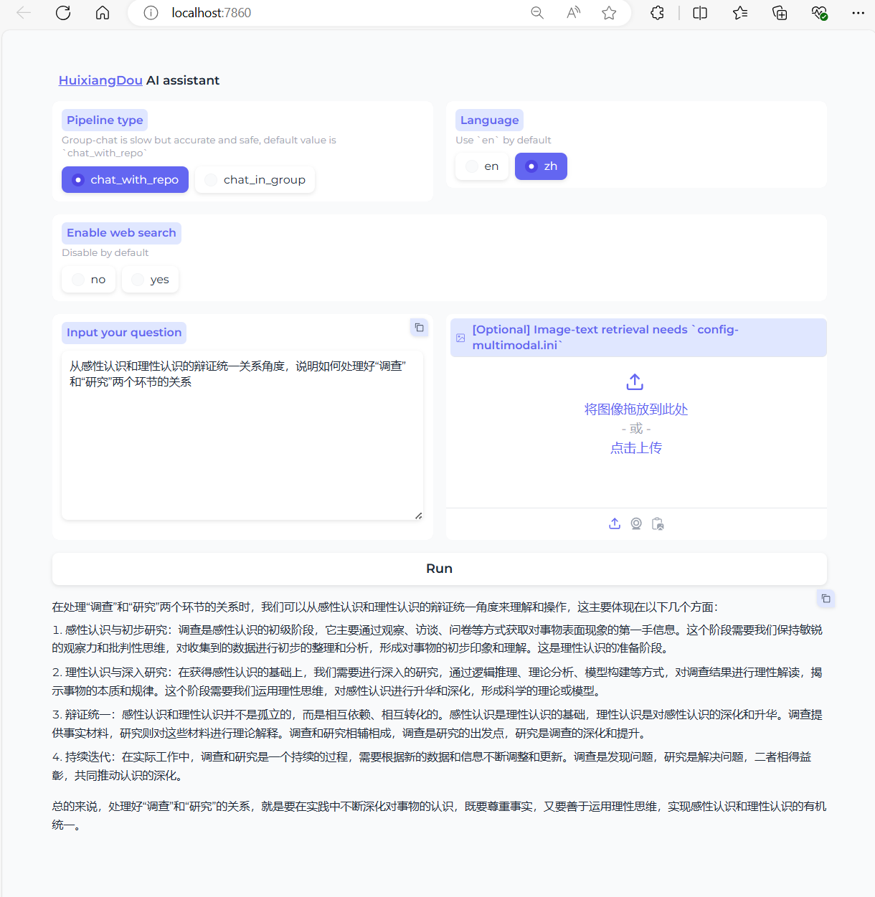
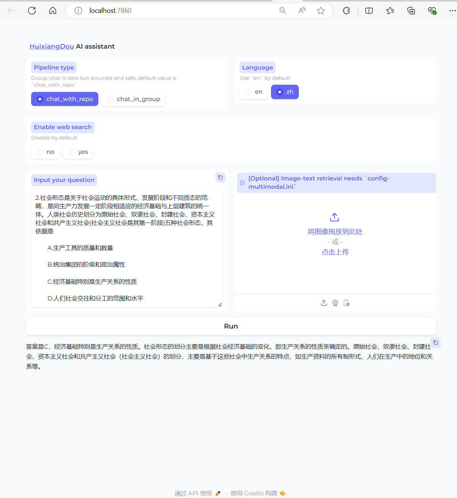

# 茴香豆知识库
### 茴香豆复现流程
- 配置远程服务  
修改config.ini
```ini
embedding_model_path = https://api.siliconflow.cn/v1/embeddings
reranker_model_path = "https://api.siliconflow.cn/v1/rerank"
api_token = ****
enable_local = 0
enable_remote = 1
remote_type = "siliconcloud"
remote_api_key = ****
remote_llm_model = "Qwen/Qwen1.5-7B-Chat"
```
- 配置环境（略） 
创建本地知识库(考研政治核心考案)  
```bash
(huixiangdou) root@intern-studio-50088800:~/InternLM-813/L2/HuiXiangDou/huixiangdou# python -m huixiangdou.service.feature_store
```
- 启动服务
```bash
(huixiangdou) root@intern-studio-50088800:~/InternLM-813/L2/HuiXiangDou/huixiangdou# python3 -m huixiangdou.gradio
```

***
### 测试结果
1. 简答题1
   
2. 简答题2  
  
3. 2023年考研政治选择题2
  
回答正确  