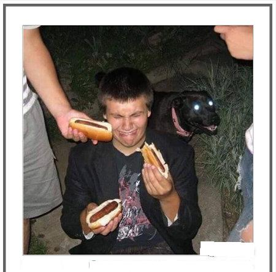
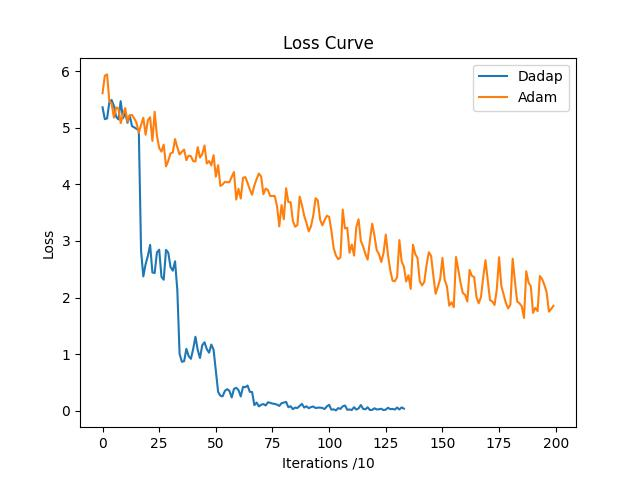

# InternVL(冷笑话大师)部署微调实践
### 复现流程
准备环境（略）  
准备模型/数据集  
```bash
(demo) (base) root@intern-studio-50088800:~/InternLM-813/L2/InternVL# ln -s /root/share/new_models/datasets/CLoT_cn_2000/ ./
(demo) (base) root@intern-studio-50088800:~/InternLM-813/L2/InternVL# ln -s /root/share/new_models/OpenGVLab/InternVL2-2B ./
(demo) (base) root@intern-studio-50088800:~/InternLM-813/L2/InternVL# ls
CLoT_cn_2000  InternVL2-2B  README.md
```
准备测试图片
```bash
(demo) (base) root@intern-studio-50088800:~/InternLM-813/L2/InternVL# cp CLoT_cn_2000/ex_images/007aPnLRgy1h9bhf3l6i9j30ci0eldh5.jpg ./test.jpg
```

测试图片的数据信息👇
```json
{
"image": "ex_images/007aPnLRgy1h9bhf3l6i9j30ci0eldh5.jpg",
"conversations": [
    {
    "from": "human",
    "value": "<image>\n请你根据这张图片，讲一个脑洞大开的梗"
    },
    {
    "from": "gpt",
    "value": "猜猜哪个夹的是狗屎"
    }
]
}
```
根据[部署脚本](./test_lmdeploy.py)，进行微调前测试  
测试结果(无flash attention版)👇
```bash
(demo) (base) root@intern-studio-50088800:~/InternLM-813/L2/InternVL# python test_lmdeploy.py 
这张图片里的搞笑点在于，有人把热狗递给一个坐在地上、面无表情的男子，而男子看起来完全不知道对方在做什么，甚至可能在笑。这个场景实际上是一个“无表情派对”的梗，通常用于形容在派对或聚会中，某个人对眼前发生的事情无动于衷或漠不关心，甚至可能在笑。

这个梗的来源可以追溯到一种“无表情派对”的流行文化，即人们在派对或聚会中，当有人向他们展示一些搞笑或无意义的东西时，他们可能会感到困惑或无奈，甚至可能在笑。这个梗被广泛用于各种幽默场景中，用来表达一种“看开”、“无所谓”的态度。

这个梗之所以有趣，是因为它展示了人们面对突发状况时的反应，突显了在面对某些搞笑或无意义的事情时，人们往往会表现出一种“无表情”的态度，从而引发一种幽默效果。
```
带flash attention版👇
```bash
(demo) (base) root@intern-studio-50088800:~/InternLM-813/L2/InternVL# python test_lmdeploy.py 
Special tokens have been added in the vocabulary, make sure the associated word embeddings are fine-tuned or trained.
Special tokens have been added in the vocabulary, make sure the associated word embeddings are fine-tuned or trained.
[WARNING] gemm_config.in is not found; using default GEMM algo                                                                     
这张图片展示了一个搞笑的情景：一个人手里拿着两个热狗，脸上露出夸张的笑容，而一只黑色的狗狗正站在他的身后，眼神直勾勾地盯着他的脸。这个场景让人不禁联想到一个经典的“狗狗吃人”的梗，即狗狗被人类食物吸引，甚至接近人类，而人类则表现出一种滑稽的、吃惊的表情。

这个梗通常用来表达一种“狗狗想吃人”的搞笑情景，让人忍俊不禁。因为狗狗的视觉和嗅觉能力有限，它们无法分辨食物的来源，所以它们经常会误以为人类是食物来源，从而表现出类似的行为。这个梗在网络社区中非常流行，常被用来制造笑料和娱乐效果。
```
准备微调配置文件
```bash
(demo) (base) root@intern-studio-50088800:~/InternLM-813/L2/InternVL# xtuner copy-cfg internvl_v2_internlm2_2b_qlora_finetune ./
Copy to ./internvl_v2_internlm2_2b_qlora_finetune_copy.py
```
开始训练！
```bash
export NPROC_PER_MODE=1
xtuner train ./internvl_v2_internlm2_2b_qlora_finetune_copy.py --deepspeed deepspeed_zero1
```

训练完成后运行
```bash
python xtuner/xtuner/configs/internvl/v1_5/convert_to_official.py ./internvl_v2_internlm2_2b_qlora_finetune_copy.py  work_dir/i
nternvl_qlora_ft/iter_2000.pth ./work_dir/converted_intervl_qlora_config
```
将模型转为标准hf模型；
后运行[脚本](./test_qlora.py)
- 小插曲
一开始运行时报错：
```bash
python test_qlora.py 
Special tokens have been added in the vocabulary, make sure the associated word embeddings are fine-tuned or trained.
Special tokens have been added in the vocabulary, make sure the associated word embeddings are fine-tuned or trained.
[WARNING] gemm_config.in is not found; using default GEMM algo                                                                                                                        
Traceback (most recent call last):
  File "/root/InternLM-813/L2/InternVL/test_qlora.py", line 4, in <module>
    pipe = pipeline('/root/InternLM-813/L2/InternVL/work_dir/converted_intervl_qlora_config')
  File "/root/.conda/envs/demo/lib/python3.10/site-packages/lmdeploy/api.py", line 89, in pipeline
    return pipeline_class(model_path,
  File "/root/.conda/envs/demo/lib/python3.10/site-packages/lmdeploy/serve/vl_async_engine.py", line 29, in __init__
    self.vl_prompt_template = get_vl_prompt_template(
  File "/root/.conda/envs/demo/lib/python3.10/site-packages/lmdeploy/vl/templates.py", line 308, in get_vl_prompt_template
    assert type(chat_template) != type(BaseModel()), 'failed to match ' \
AssertionError: failed to match chat template, please explicit set chat_template_config
```
找不到Template，根据群佬的回复，可在pipeline指定chat template  

效果：  

```bash
(demo) (base) root@intern-studio-50088800:~/InternLM-813/L2/InternVL# python test_qlora.py    
Special tokens have been added in the vocabulary, make sure the associated word embeddings are fine-tuned or trained.
Special tokens have been added in the vocabulary, make sure the associated word embeddings are fine-tuned or trained.
[WARNING] gemm_config.in is not found; using default GEMM algo                                                                                                                        
他不是被狗吃了，是被人下了毒，但是味道还不错。
```
***
### 进阶教程
本人不会调参，所以选了一个不用调参（大概）的Optimizer--> DAdapAdam
配置文件附在[脚本](./diy_config)
依照上述流程进行训练后，训练loss对比如下图所示：

（因为在使用DAdapAdam训练时把batchsize增大了，所以iter小）
***
**测试效果**  


```bash
(demo) (base) root@intern-studio-50088800:~/InternLM-813/L2/InternVL# python test_diy_config.py 
Special tokens have been added in the vocabulary, make sure the associated word embeddings are fine-tuned or trained.
Special tokens have been added in the vocabulary, make sure the associated word embeddings are fine-tuned or trained.
[WARNING] gemm_config.in is not found; using default GEMM algo                                                                                                                        
猜猜哪个夹的是狗屎
```


```bash
(demo) (base) root@intern-studio-50088800:~/InternLM-813/L2/InternVL# python test_qlora.py      
Special tokens have been added in the vocabulary, make sure the associated word embeddings are fine-tuned or trained.
Special tokens have been added in the vocabulary, make sure the associated word embeddings are fine-tuned or trained.
[WARNING] gemm_config.in is not found; using default GEMM algo                                                                                                                        
我嘴上的表达：老子被雷劈了
```
```bash
(demo) (base) root@intern-studio-50088800:~/InternLM-813/L2/InternVL# python test_diy_config.py 
Special tokens have been added in the vocabulary, make sure the associated word embeddings are fine-tuned or trained.
Special tokens have been added in the vocabulary, make sure the associated word embeddings are fine-tuned or trained.
[WARNING] gemm_config.in is not found; using default GEMM algo                                                                                                                        
我没吃过豆腐，但是我吃过了蛋白粉，没错，就是你了，AC Gai，这下你吃醋了是不是？
```


```bash
(demo) (base) root@intern-studio-50088800:~/InternLM-813/L2/InternVL# python test_qlora.py 
Special tokens have been added in the vocabulary, make sure the associated word embeddings are fine-tuned or trained.
Special tokens have been added in the vocabulary, make sure the associated word embeddings are fine-tuned or trained.
[WARNING] gemm_config.in is not found; using default GEMM algo                                                                                                                        
左：你好，我叫左
```

```bash
(demo) (base) root@intern-studio-50088800:~/InternLM-813/L2/InternVL# python test_diy_config.py 
Special tokens have been added in the vocabulary, make sure the associated word embeddings are fine-tuned or trained.
Special tokens have been added in the vocabulary, make sure the associated word embeddings are fine-tuned or trained.
[WARNING] gemm_config.in is not found; using default GEMM algo                                                                                                                        
狗
```
  
```bash
(demo) (base) root@intern-studio-50088800:~/InternLM-813/L2/InternVL# python test_qlora.py 
Special tokens have been added in the vocabulary, make sure the associated word embeddings are fine-tuned or trained.
Special tokens have been added in the vocabulary, make sure the associated word embeddings are fine-tuned or trained.
[WARNING] gemm_config.in is not found; using default GEMM algo                                                                                                                        
欢迎光临！
```

```bash
(demo) (base) root@intern-studio-50088800:~/InternLM-813/L2/InternVL# python test_diy_config.py 
Special tokens have been added in the vocabulary, make sure the associated word embeddings are fine-tuned or trained.
Special tokens have been added in the vocabulary, make sure the associated word embeddings are fine-tuned or trained.
[WARNING] gemm_config.in is not found; using default GEMM algo                                                                                                                        
我做了。
```


