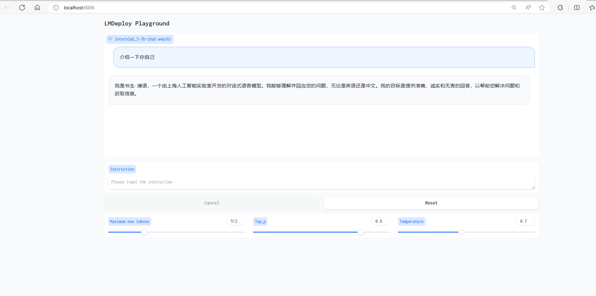

# LMdeploy量化部署

复现流程：

- 创建软链接
```bash
(demo) (base) root@intern-studio-50088800:~/InternLM-813/L2# ln -s /share/new_models/Shanghai_AI_Laboratory/internlm2_5-7b-chat ./LMDeploy/
(demo) (base) root@intern-studio-50088800:~/InternLM-813/L2# cd LMDeploy/
```
- 创建模型输出目录
```bash
(demo) (base) root@intern-studio-50088800:~/InternLM-813/L2/LMDeploy# mkdir internlm2_5-7b-chat-w4a16
```
- 声明源模型地址与工作区地址
```bash
(demo) (base) root@intern-studio-50088800:~/InternLM-813/L2/LMDeploy# export SOURCE_DIR=internlm2_5-7b-chat && export WORK_DIR=internlm2_5-7b-chat-w4a16
```
- 开始量化！
```bash
(demo) (base) root@intern-studio-50088800:~/InternLM-813/L2/LMDeploy# lmdeploy lite auto_awq $SOURCE_DIR --calib-dataset 'ptb' --calib-samples 128 --calib-seqlen 204
8 --w-bits 4 --w-group-size 128 --batch-size 1 --search-scale False --work-dir $WORK_DIR
```
**Attention** 记得在提示 Do you wish to run the custom code? [y/N] 时 输入y并回车！

量化完成后进行部署：  

```bash
(demo) (base) root@intern-studio-50088800:~/InternLM-813/L2/LMDeploy# lmdeploy serve api_server internlm2_5-7b-chat-w4a16/ --model-format awq --cache-max-entry-count 0.4 quant-policy 4 --server-name 0.0.0.0 --server-port 23333 --tp 1
(demo) (base) root@intern-studio-50088800:~# lmdeploy serve gradio http://localhost:23333     --server-name 0.0.0.0    --server-port 6006
```

进行对话测试


显存占用如下所示：

```bash
(demo) (base) root@intern-studio-50088800:~# studio-smi
Running studio-smi by vgpu-smi
Sat Aug 17 06:43:22 2024
+------------------------------------------------------------------------------+
| VGPU-SMI 1.7.13       Driver Version: 535.54.03     CUDA Version: 12.2       |
+-------------------------------------------+----------------------------------+
| GPU  Name                Bus-Id           |        Memory-Usage     GPU-Util |
|===========================================+==================================|
|   0  NVIDIA A100-SXM...  00000000:8E:00.0 | 13578MiB / 24566MiB    0% /  30% |
+-------------------------------------------+----------------------------------+
```
简单计算，模型占用空间为：$$7B/2 Bytes = 3.5GB $$
剩余$24-3.5=21.5$GB显存，kv-kache占用 $21.5*0.4=8.6GB$ ,
简单计算，占用约13GB，实际显存占用与预期相当！