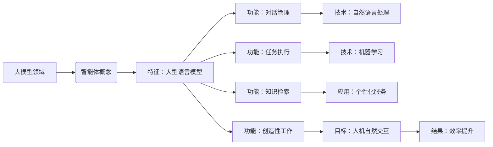

# Lagent智能体构建
### 前置知识补全

```mermaid
graph LR
    A["大模型领域"] --> B("智能体概念")
    B --> C["特征：大型语言模型"]
    C --> D["功能：对话管理"]
    C --> E["功能：任务执行"]
    C --> F["功能：知识检索"]
    C --> G["功能：创造性工作"]
    D --> H["技术：自然语言处理"]
    E --> I["技术：机器学习"]
    F --> J["应用：个性化服务"]
    G --> K["目标：人机自然交互"]
    K --> L["结果：效率提升"]
```