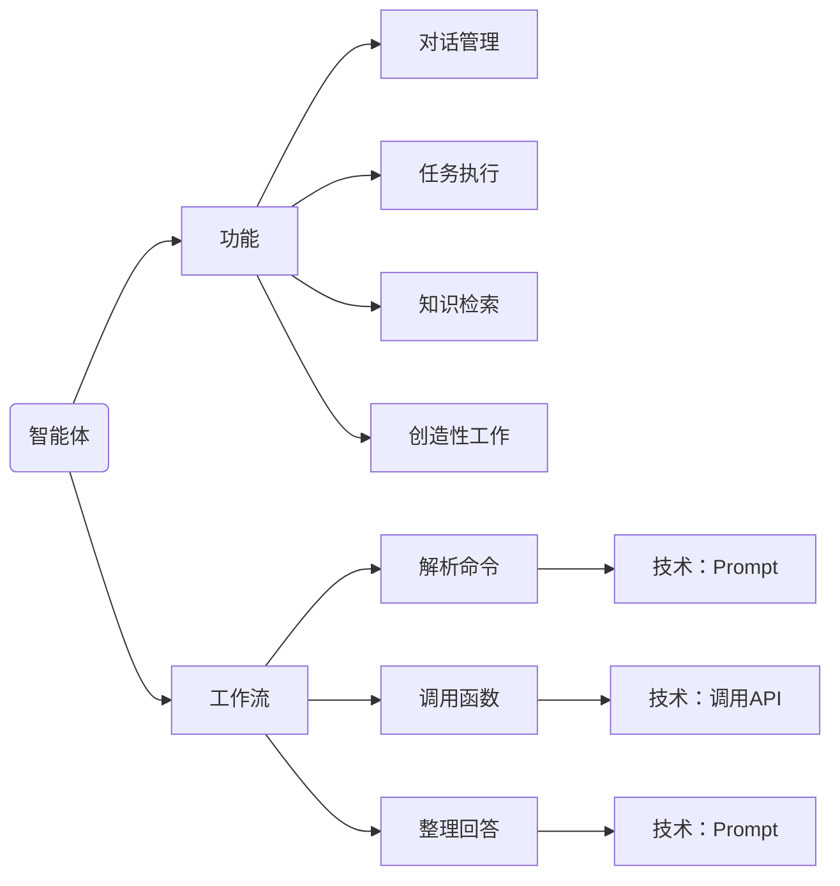

# Lagent智能体构建
### 前置知识补全

```mermaid
graph LR
    B("智能体")
    B --> C["功能"]
    C --> D["对话管理"]
    C --> E["任务执行"]
    C --> F["知识检索"]
    C --> G["创造性工作"]
    B--> H["工作流"]
    H-->I["解析命令"]-->J["技术：Prompt"]
    H-->K["调用函数"]-->L["技术：调用API"]
    H-->M["整理回答"]-->N["技术：Prompt"]

```