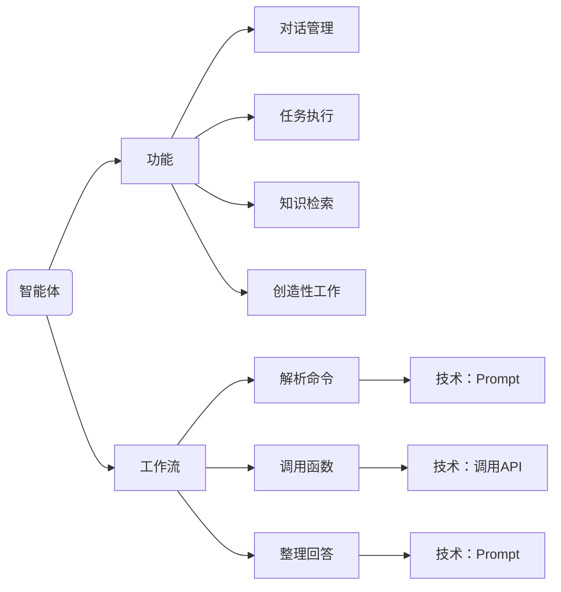
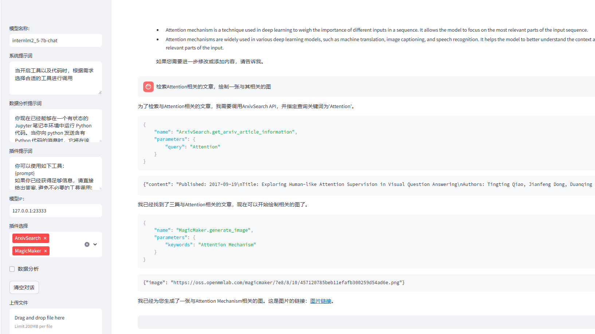

# Lagent智能体构建
### 前置知识补全

### 复现流程
- 根据[教程](https://github.com/InternLM/Tutorial/tree/camp3/docs/L2/Lagent)搭建环境  
- 部署本地大模型API  

```bash
(demo) root@intern-studio-50088800:~/InternLM-813/L2/Lagent# lmdeploy serve api_server /share/new_models/Shanghai_AI_Laboratory/internlm2_5-7b-chat --model-name internlm2_5-7b-chat
```
- 应用Lagent,开启streamlit服务

```bash
(demo) root@intern-studio-50088800:~/InternLM-813/L2/Lagent# streamlit run lagent/examples/internlm2_agent_web_demo.py 

Collecting usage statistics. To deactivate, set browser.gatherUsageStats to false.


  You can now view your Streamlit app in your browser.

  Local URL: http://localhost:8501
  Network URL: http://192.168.233.67:8501
  External URL: http://192.168.233.67:8501

```

报错

```bash
TypeError: string indices must be integers
Traceback:
File "/root/.conda/envs/demo/lib/python3.10/site-packages/streamlit/runtime/scriptrunner/exec_code.py", line 75, in exec_func_with_error_handling
    result = func()
File "/root/.conda/envs/demo/lib/python3.10/site-packages/streamlit/runtime/scriptrunner/script_runner.py", line 574, in code_to_exec
    exec(code, module.__dict__)
File "/root/InternLM-813/L2/Lagent/lagent/examples/internlm2_agent_web_demo.py", line 333, in <module>
    main()
File "/root/InternLM-813/L2/Lagent/lagent/examples/internlm2_agent_web_demo.py", line 286, in main
    for agent_return in st.session_state['chatbot'].stream_chat(
File "/root/InternLM-813/L2/Lagent/lagent/lagent/agents/internlm2_agent.py", line 303, in stream_chat
    for model_state, res, _ in self._llm.stream_chat(prompt, **kwargs):
File "/root/InternLM-813/L2/Lagent/lagent/lagent/llms/lmdeploy_wrapper.py", line 422, in stream_chat
    resp += text['choices'][0]['text']
```

修改模型IP后  
报错  

```bash
KeyError: 'choices'
Traceback:
File "/root/.conda/envs/demo/lib/python3.10/site-packages/streamlit/runtime/scriptrunner/exec_code.py", line 75, in exec_func_with_error_handling
    result = func()
File "/root/.conda/envs/demo/lib/python3.10/site-packages/streamlit/runtime/scriptrunner/script_runner.py", line 574, in code_to_exec
    exec(code, module.__dict__)
File "/root/InternLM-813/L2/Lagent/lagent/examples/internlm2_agent_web_demo.py", line 333, in <module>
    main()
File "/root/InternLM-813/L2/Lagent/lagent/examples/internlm2_agent_web_demo.py", line 286, in main
    for agent_return in st.session_state['chatbot'].stream_chat(
File "/root/InternLM-813/L2/Lagent/lagent/lagent/agents/internlm2_agent.py", line 303, in stream_chat
    for model_state, res, _ in self._llm.stream_chat(prompt, **kwargs):
File "/root/InternLM-813/L2/Lagent/lagent/lagent/llms/lmdeploy_wrapper.py", line 422, in stream_chat
    resp += text['choices'][0]['text']
```

修改模型名称为internlm2_5-7b-chat后，无报错，正常响应！

结果如下所示：


在对配置文件进行修改后，使其根据检索文章结果进行图片生成，工具成功被调用：

