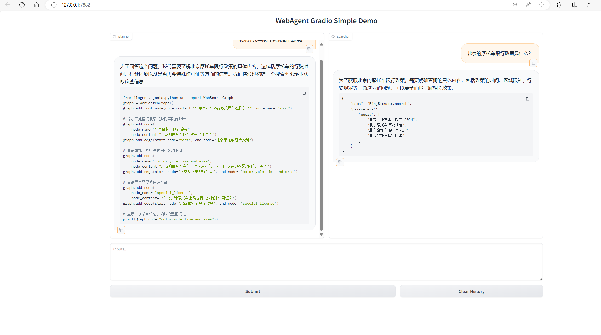
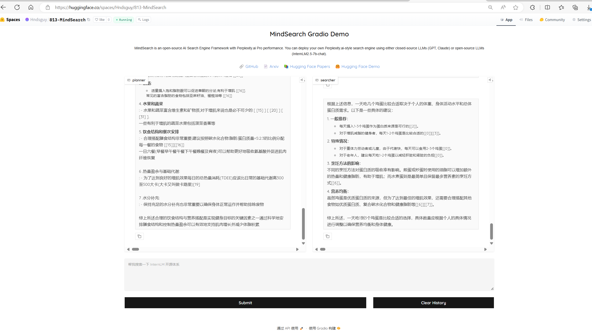

# MindSearch部署
### CPU-Only 本地部署
运行命令
开启后端服务
```bash
export SILICON_API_KEY=****
python -m mindsearch.app --lang cn --model_format internlm_silicon --search_engine DuckDuckGoSearch
```
开启前端服务
```bash
python frontend/mindsearch_gradio.py
```
效果图：  

***
### HuggingFace部署
[部署链接](https://huggingface.co/spaces/Hndsguy/813-MindSearch):https://huggingface.co/spaces/Hndsguy/813-MindSearch
在HuggingFace上完成Space创建后，添加ssh-key，将Space克隆到本地
```bash
(demo) (base) root@intern-studio-50088800:~/InternLM-813/L2/MindSearch# git clone git@hf.co:spaces/Hndsguy/813-MindSearch     
```
创建app.py文件
```bash
(demo) (base) root@intern-studio-50088800:~/InternLM-813/L2/MindSearch/813-MindSearch# touch app.py
```
```
app.py文件其实是上述gradio前端文件，只不过在文件起始加入了一行命令：os.system("python -m mindsearch.app --lang cn --model_format internlm_silicon &")，开启后端服务；
```

复制mindsearch和requirement到项目目录下
```bash
(demo) (base) root@intern-studio-50088800:~/InternLM-813/L2/MindSearch/813-MindSearch# cp -r ../MindSearch/mindsearch/ ./
(demo) (base) root@intern-studio-50088800:~/InternLM-813/L2/MindSearch/813-MindSearch# cp ../MindSearch/requirements.txt ./
```
使用git添加文件并上传到HuggingFace
```bash
(demo) (base) root@intern-studio-50088800:~/InternLM-813/L2/MindSearch/813-MindSearch# cp ../MindSearch/requirements.txt ./
(demo) (base) root@intern-studio-50088800:~/InternLM-813/L2/MindSearch/813-MindSearch# git add .                      
(demo) (base) root@intern-studio-50088800:~/InternLM-813/L2/MindSearch/813-MindSearch# git commit -a
(demo) (base) root@intern-studio-50088800:~/InternLM-813/L2/MindSearch/813-MindSearch# git push
```

启动服务  
提问 英伟达A6000显卡的性能如何？  
  
Gradio中加入theme设定：theme=gr.themes.Monochrome()进行UI美化，美化后的界面如图所示：  


